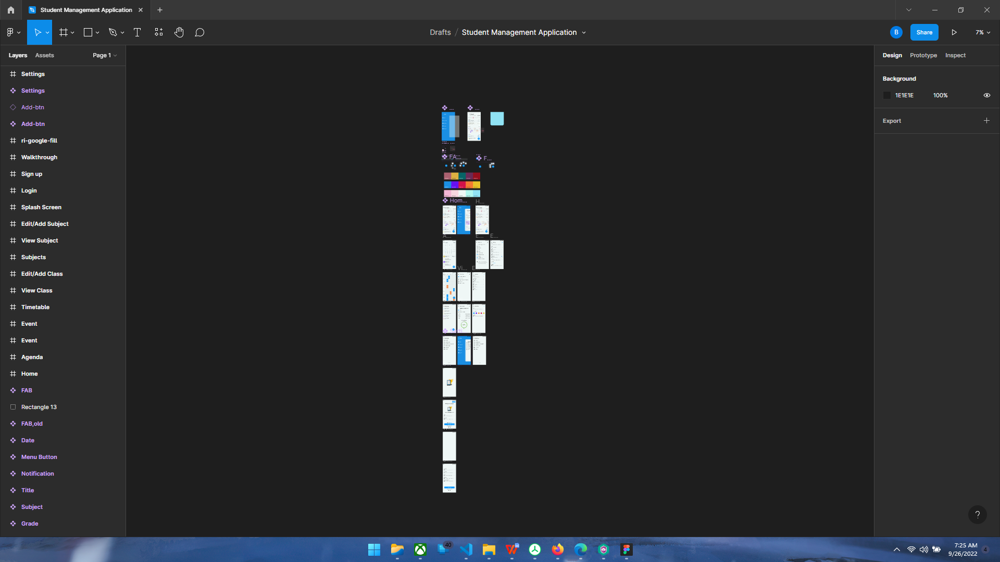
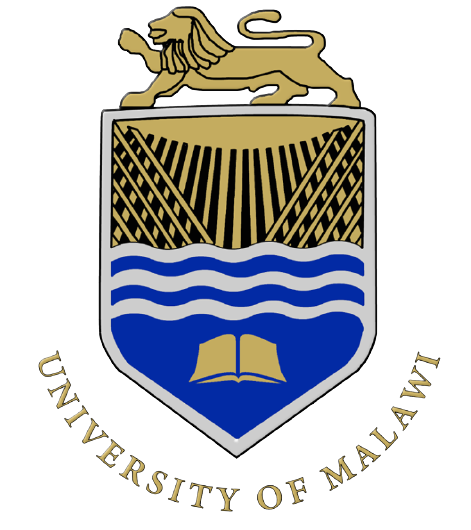

# Student-Management

---

## **Table of Contents**

* [Description](#description)
* [Prerequisites](#prerequisites)
* [Progress](#progress)
* [Author Info](#author-info)

---

## Description

### Aim
> To develop a mixture of a calendar, timetable and progress tracker app to keep track of a student’s schedule and performance throughout their time at school.

### Motivation
This app has been initiated in order to simplify many issues students face in school by allowing them to quickly and easily organize and plan a structure of events occurring in their schools into their mobile devices for quick review.

### Key features
* Keeps track of subject details such as subject title, teacher(s) involved, pending work such as exams or homework and 
* Schedules events such as homework, exams, study sessions or any other school related events in the inbuilt calendar.
* Option to add alarms and notifications as remainders of these events.
* Quick and easily search for events.
* Creates and keeps track of a student’s class timetable.
* Option to place quick information on home widgets.

[Back to the Top](#student-management)

---

## Prerequisites

### Skills
* 

### Technologies
* 

### Tools
* 

[Back to the Top](#student-management)

---

## Progress
Currently working on the C4 architecture of the app

### Latest development

### Tasks
* [X] Prototyping
    * ##### C4 Diagrams
    * ##### Wireframe
    * ##### Figma prototype

[Back to the Top](#student-management)

---

## Author Info

#### Developed by [Bright Nthara](bed-hec-30-18@cc.ac.mw "Email link")

### Code owners
[Isaac Mwakabira](imwakabira@unima.ac.mw "Email Link")

### License

Copyright © 2021 - All Rights Reserved - [Chancellor College](https://www.cc.ac.mw/ "Page Link")

[Back to the Top](#student-management)

---
